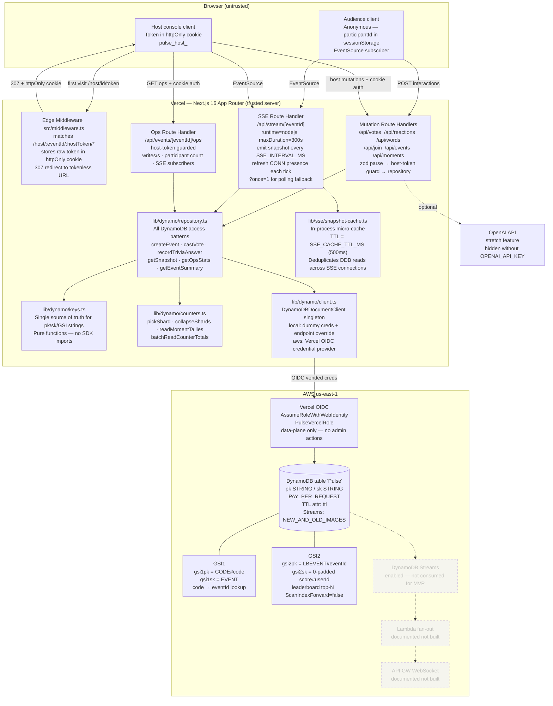
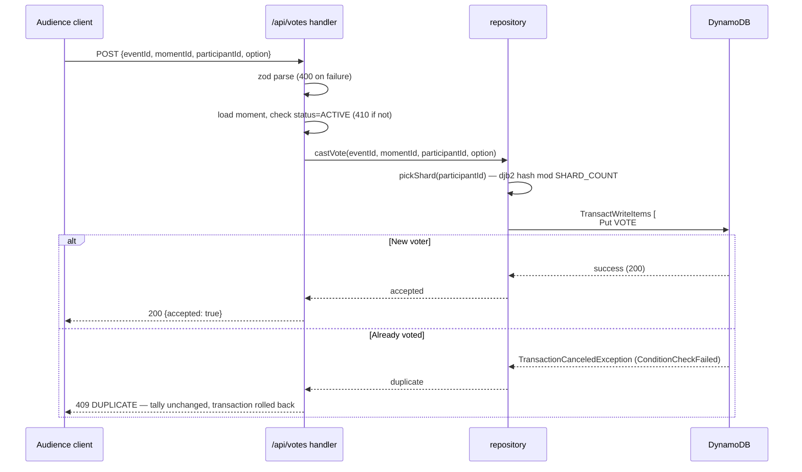
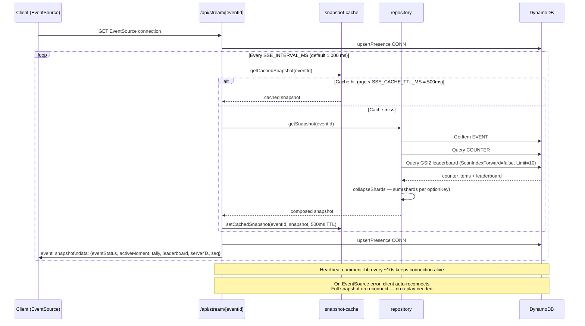
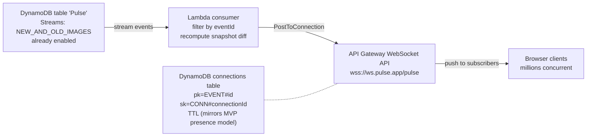

# Pulse — Architecture

> Drawn from PLAN.md (v1.1) and verified against the live codebase.

---

## 1. Component Diagram



---

## 2. Single-Table Design

### Table definition

| Property | Value |
|----------|-------|
| Table name | `Pulse` |
| Partition key | `pk` (String) |
| Sort key | `sk` (String) |
| Billing | `PAY_PER_REQUEST` |
| TTL attribute | `ttl` (epoch seconds, applied per item type — see TTL policy below) |
| Streams | `NEW_AND_OLD_IMAGES` |
| Region | `us-east-1` |
| PITR | Enabled |

### GSIs

| Index | Partition key | Sort key | Projection | Purpose |
|-------|--------------|----------|------------|---------|
| GSI1 | `gsi1pk` = `CODE#<code>` | `gsi1sk` = `EVENT` | KEYS_ONLY + eventId | Resolve join code → eventId |
| GSI2 | `gsi2pk` = `LBEVENT#<eventId>` | `gsi2sk` = `padStart(10,'0')(score)#userId` | INCLUDE displayName, score | Top-N leaderboard, `ScanIndexForward=false`, no Scan |

### Entity map

| Entity | `pk` | `sk` | Access pattern | Index |
|--------|------|------|----------------|-------|
| EVENT metadata | `EVENT#<id>` | `METADATA` | Create / read / close event | Base table |
| CODE lookup | `CODE#<code>` | `EVENT` | Resolve code → eventId; collision-checked conditional Put | Base + GSI1 |
| MOMENT | `EVENT#<id>` | `MOMENT#<momentId>` | Launch / close moment; read by activeMomentId | Base table |
| VOTE dedup | `EVENT#<id>` | `VOTE#<momentId>#<userId>` | Conditional Put (`attribute_not_exists`) — prevents double vote | Base table |
| COUNTER shard | `EVENT#<id>` | `COUNTER#<momentId>#<optionKey>#<shard>` | `ADD count :1` on write; `Query begins_with + collapse` on read | Base table |
| REACTION (ephemeral) | `EVENT#<id>` | `REACTION#<ts>#<reactionId>` | Put with TTL; replay burst visualization | Base table |
| WORD | `EVENT#<id>` | `WORD#<momentId>#<userId>` | Conditional Put (one per participant); `Query begins_with` for cloud | Base table |
| LB (leaderboard) | `EVENT#<id>` | `LB#<userId>` | `ADD score :pts` + recompute `gsi2sk`; GSI2 top-N read | Base + GSI2 |
| USER (participant) | `EVENT#<id>` | `USER#<userId>` | Put at join; `Query begins_with` count for summary | Base table |
| CONN (presence) | `EVENT#<id>` | `CONN#<connId>` | Put/refresh each heartbeat tick (TTL = now + 15s); Query count | Base table |
| OPS#WRITES bucket | `EVENT#<id>` | `OPS#WRITES#<epochSec>` | `ADD count :1` per mutation; Query range for writes/s | Base table |

### TTL policy (per item type)

Durable items needed for the analytics summary carry **no TTL**:

| Type | TTL | Reason |
|------|-----|--------|
| EVENT, CODE, MOMENT, COUNTER, LB, USER, WORD | **None** | Needed for summary and judging window |
| VOTE dedup | `createdAt + JUDGING_WINDOW_DAYS` | Dedup must not lapse while event is live; TTL is set well beyond any live event |
| REACTION | `ts + REACTION_TTL_SEC` (default 600 s) | Ephemeral burst buffer; counts live in durable COUNTER shards |
| CONN presence | `lastSeen + PRESENCE_TTL_SEC` (default 15 s) | Liveness window; expiry is the disconnect signal |
| OPS#WRITES bucket | `epochSec + OPS_WRITES_TTL_SEC` (default 60 s) | Rolling write-rate window only |

---

## 3. Critical Write Path — Vote (The Hero Flow)



The single `TransactWriteItems` call guarantees: a vote exists in DynamoDB **if and only if** its shard counter was incremented. No separate transaction, no partial failure, no divergence.

---

## 4. Read Path — SSE Snapshot Aggregation



### Polling fallback

`GET /api/stream/[eventId]?once=1` returns a single JSON snapshot using the same micro-cache. The client hook `useLiveSnapshot` switches to polling at `POLL_INTERVAL_MS` (default 3 000 ms) if SSE fails to recover within `SSE_RECONNECT_GRACE_MS`.

---

## 5. Latency Budget

Worst-case decomposition for the SSE path (SC2 gate: p95 < 2 000 ms):

| Term | Worst case |
|------|-----------|
| Vote write commit (TransactWriteItems) | ~80 ms |
| Time until next SSE emit tick | ≤ `SSE_INTERVAL_MS` = 1 000 ms |
| Micro-cache staleness | ≤ `SSE_CACHE_TTL_MS` = 500 ms |
| Snapshot compute (Query + collapse) | ~60 ms |
| Network RTT server → client | ~150 ms |
| Client render | ~50 ms |
| **Modeled worst case** | **~1 840 ms** (< 2 000 ms gate) |

Measured p95 on DDB Local: **~1.3 s**.

---

## 6. Presence and Peak Concurrent

Decrement-on-disconnect is unreliable on serverless SSE. Pulse uses a TTL/heartbeat model instead:

- When an SSE connection opens, the handler writes `CONN#<connId>` with `ttl = now + 15s`.
- Every heartbeat tick (every ~5 s = `PRESENCE_HEARTBEAT_MS`) re-puts the item with a bumped TTL.
- A connection that goes away stops refreshing; DynamoDB TTL sweeps the item.
- Live count (`sseSubscriberCount`): `Query begins_with(sk, 'CONN#')` filtered to items where `ttl > now`.
- Peak concurrent: on each snapshot computation, `SET peakConcurrent = max(current, live)` is applied conditionally to EVENT METADATA. The summary reads the durable `peakConcurrent` field.

This design is multi-instance safe — all presence items live in DynamoDB, not in per-function memory.

---

## 7. Local vs Production DynamoDB Client

`src/lib/dynamo/client.ts` is a lazy singleton that branches on `PULSE_DB_MODE`:

| Mode | Endpoint | Credentials |
|------|----------|-------------|
| `local` | `http://localhost:8000` (or `DYNAMODB_LOCAL_ENDPOINT`) | Dummy static (`local`/`local`) — DDB Local ignores them |
| `aws` with `AWS_ROLE_ARN` set | AWS regional endpoint | Vercel OIDC `awsCredentialsProvider({roleArn})` — short-lived, no stored keys |
| `aws` without `AWS_ROLE_ARN` | AWS regional endpoint | Default provider chain (instance profile, env vars, etc.) |

The singleton is created once per Node.js process and reused across all Route Handlers and SSE ticks to amortize connection overhead.

---

## 8. Host Auth Flow

```mermaid
sequenceDiagram
  participant H as Host browser
  participant MW as Edge Middleware
  participant HC as Host console page
  participant API as /api/events/[eventId]/ops

  H->>MW: GET /host/<eventId>/<rawToken>
  MW->>MW: extract eventId + rawToken from path\n(guard: skip if segment == "summary")
  MW->>H: 307 redirect to /host/<eventId>\n+ Set-Cookie: pulse_host_<eventId>=<rawToken>\n  httpOnly; SameSite=Strict; Secure (on HTTPS)

  H->>HC: GET /host/<eventId>  (tokenless URL, cookie present)
  HC->>HC: Server Component reads cookie\nextractHostTokenFromCookie(req, eventId)
  HC->>HC: verifyToken(rawToken, event.hostTokenHash)\n(timingSafeEqual of SHA-256 hashes)

  H->>API: GET /api/events/<eventId>/ops\n(cookie sent automatically)
  API->>API: extractHostToken(req) or extractHostTokenFromCookie(req, eventId)\nverifyToken(...) → 401 if mismatch
  API-->>H: ops stats
```

The raw token is never stored in DynamoDB — only its SHA-256 hash (`hostTokenHash`). The `verifyToken` function uses `timingSafeEqual` to prevent timing attacks.

---

## 9. Million-Scale Path (Documented, Not Built for MVP)

The MVP SSE fan-out ceiling is ~1 000 concurrent connections per event (single Vercel function). DynamoDB Streams are already enabled, making the scale-out path a wiring exercise:



The client transport seam is `src/hooks/useLiveSnapshot.ts` — adding a `websocket` branch there is the only client-side change needed. The table and GSIs require no modifications.

See DEPLOYMENT.md § 12 for the full component list.
