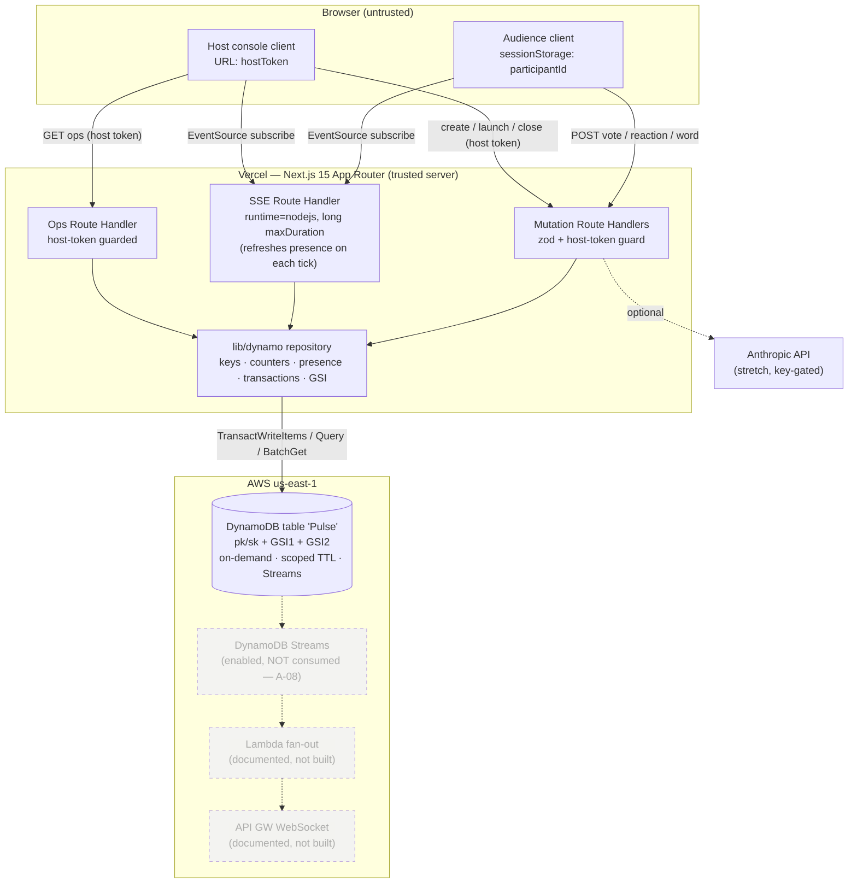
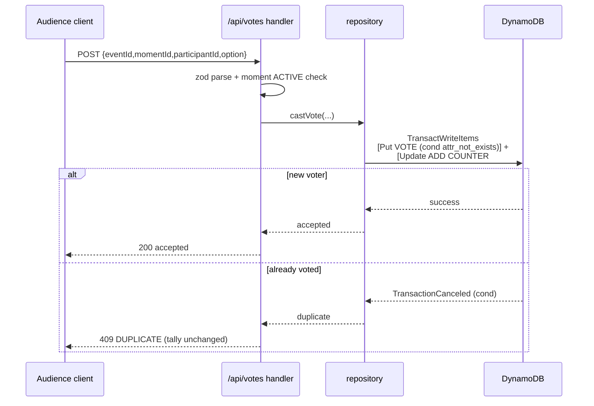

# Pulse — Engineering Plan

> Status: v1.1 (2026-06-20)
> Author: Architect
> Source of truth: `REQUIREMENTS.md`, `ASSUMPTIONS.md`, `DESIGN.md` (approved)
> Track: 3 — Million-scale global app. Hero database: Amazon DynamoDB (single-table).

This plan turns the approved requirements into a buildable design. Every section traces back to a requirement ID (`F-*`, `NFR-*`, `SC*`) or assumption (`A-*`). Routes and component surfaces trace to the approved `DESIGN.md`. The DynamoDB data model is the centre of the technical story; everything else exists to showcase it.

---

## 0. TL;DR for Reviewers

- **One DynamoDB table** (`Pulse`) with `pk`/`sk`, two GSIs, on-demand billing, scoped TTL, and Streams enabled-but-not-consumed.
- **Atomic vote path**: `TransactWriteItems` writes a conditional dedup record AND increments one of >=10 counter shards in a single transaction, so a vote and its tally can never diverge (F-02.1.2, F-02.1.4, SC3, SC4).
- **Server-authoritative trivia scoring**: the host's launch sets `activatedAt` on the moment; the server computes remaining time from `serverReceiveTs - activatedAt`, never from a client-supplied timestamp; trivia score is per-event-cumulative via `ADD`.
- **Real-time** via an SSE Route Handler streaming aggregated counters every ~1.0 s, with automatic HTTP-polling fallback (F-03.1, F-03.2). The worst-case latency budget is stated and gated in M3. The Streams -> Lambda -> WebSocket scale-out is documented, not built (F-03.3, A-08).
- **Presence via TTL heartbeat**: SSE connections register short-TTL presence items refreshed each heartbeat tick; live presence count drives SSE-subscriber and peak-concurrent metrics (no unreliable decrement-on-disconnect).
- **Ops readout endpoint** (`GET /api/events/[eventId]/ops`) feeds the judge-facing OpsReadout (DESIGN §4.5).
- **Zero stored AWS keys**: local dev hits DynamoDB Local over an endpoint override; prod uses Vercel OIDC credential vending (NFR-03.1, SC8).
- **Thinnest runnable slice first**: create event -> join -> see it render, then layer moments, then real-time, then analytics. AI is gated and last (F-05, SC1–SC9).

---

## 1. Architecture

### 1.1 Components and responsibilities

| Component | Responsibility | Trust |
|-----------|----------------|-------|
| **Browser — Audience client** | Join via code, render active moment, submit interactions, consume SSE/poll stream. Anonymous identity in `sessionStorage`. | Untrusted |
| **Browser — Host console client** | Create/launch/close moments, render live aggregates + ops readout, hold host token in URL. | Semi-trusted (proves itself via host token on every mutation) |
| **Next.js Route Handlers (Vercel, Node runtime)** | The trust boundary. Validate input (zod), enforce host token, run the repository/transaction logic, stream SSE, compute server-authoritative scoring. | Trusted server |
| **`lib/dynamo` repository layer** | The only code that talks to DynamoDB. Encapsulates keys, transactions, sharded counters, presence items, GSI queries. | Trusted server |
| **DynamoDB table `Pulse`** | Single source of truth: events, codes, moments, votes, counters, reactions, words, participants, leaderboard, presence. | Trusted data store |
| **DynamoDB Local (dev only)** | Drop-in DynamoDB for offline development and load testing. | Local |
| **Anthropic API (stretch)** | Poll-question suggestions + word-cloud sentiment. Optional, key-gated. | External, optional |

### 1.2 Trust boundaries (the important one)

The single trust boundary is the Route Handler edge. Browsers never touch DynamoDB. Every state change crosses one validated, authorized choke point:

1. **Input boundary** — zod schema parse at the top of every handler (NFR-03.6).
2. **Authorization boundary** — host token hash comparison for every privileged mutation and every privileged read (ops, summary) (NFR-03.4).
3. **Identity boundary** — audience participant ID is server-issued and carried by the client; the *server* binds votes to it, so the client cannot forge another user's dedup record meaningfully (it can only ever block itself).
4. **Timing boundary** — all time-sensitive scoring (trivia) uses the server clock only; client-supplied timestamps are never trusted for scoring (see 4.5 / 7.3).

### 1.3 System diagram



### 1.4 Data flow summary

- **Write** (audience): client POST -> zod parse -> repository `TransactWriteItems` {conditional dedup Put + counter shard ADD} -> 200/409.
- **Read** (any client): SSE handler loops -> repository reads active moment + sums shards (+ leaderboard GSI) -> pushes a JSON snapshot every ~1.0 s; each tick also refreshes the connection's presence item (see 8).
- **Control** (host): host POST with token -> zod parse -> token-hash check -> repository mutates event/moment metadata (launch sets `activatedAt` for trivia timing).

---

## 2. Repository Shape (Component / Module Architecture)

Organized by feature/domain, not by file type (per coding standards). Files target 200–400 lines, 800 max. Routes match the approved `DESIGN.md` route map exactly.

```text
pulse/
├── app/
│   ├── layout.tsx                      # root layout, fonts, CSP-aware <head>
│   ├── page.tsx                        # landing: create event OR join with code (DESIGN §3 /)
│   ├── globals.css                     # tokens import, base
│   ├── join/
│   │   ├── page.tsx                    # audience join by manual code entry (DESIGN /join)
│   │   └── [code]/page.tsx             # audience join, code pre-filled from link/QR (DESIGN /join/[code])
│   ├── e/
│   │   └── [code]/page.tsx             # LIVE audience view: lobby + active-moment (DESIGN /e/[code])
│   ├── host/
│   │   └── [eventId]/[hostToken]/
│   │       ├── page.tsx                # host console (A-16, DESIGN /host/[eventId]/[hostToken])
│   │       └── summary/page.tsx        # host-token-gated analytics summary (F-04; DESIGN §3)
│   └── api/
│       ├── events/route.ts             # POST create event
│       ├── events/[eventId]/route.ts   # GET event state; POST close (host)
│       ├── events/[eventId]/ops/route.ts   # GET ops readout (host) — §4.4 (DESIGN §4.5)
│       ├── join/route.ts               # POST join by code -> participantId
│       ├── moments/route.ts            # POST launch moment (host) — sets activatedAt
│       ├── moments/[momentId]/route.ts # POST close moment (host)
│       ├── votes/route.ts              # POST MC/trivia vote (audience)
│       ├── reactions/route.ts          # POST emoji reaction (audience)
│       ├── words/route.ts              # POST word submission (audience)
│       ├── leaderboard/route.ts        # GET top-N (GSI2)
│       ├── summary/[eventId]/route.ts  # GET analytics summary payload (host-token-gated, §4.2)
│       ├── stream/[eventId]/route.ts   # GET SSE live snapshot stream (refreshes presence)
│       └── ai/
│           ├── poll-suggestions/route.ts   # POST (stretch, key-gated)
│           └── sentiment/route.ts          # POST (stretch, key-gated)
│
├── components/
│   ├── create/CreateEventForm.tsx
│   ├── join/JoinForm.tsx                  # used by /join and /join/[code]
│   ├── audience/AudienceLobby.tsx         # /e/[code] idle state (DESIGN 4.14)
│   ├── audience/ClosedEventOverlay.tsx    # /e/[code] terminal state (DESIGN 4.15)
│   ├── moment/MomentStage.tsx             # presentational switch by moment type (/e/[code])
│   ├── moment/McPoll.tsx
│   ├── moment/WordCloud.tsx               # respects prefers-reduced-motion (NFR-04.4)
│   ├── moment/ReactionBurst.tsx           # respects prefers-reduced-motion
│   ├── moment/Trivia.tsx                  # countdown driven by server activatedAt + timeLimitSec
│   ├── host/HostConsole.tsx
│   ├── host/MomentLauncher.tsx
│   ├── host/OpsReadout.tsx                # judge-facing live ops (DESIGN 4.5)
│   ├── viz/TallyBars.tsx                  # data viz as part of design system
│   ├── viz/Leaderboard.tsx
│   └── ui/                                # Button, SurfaceCard, AnimatedText, LiveRegion
│
├── hooks/
│   ├── useLiveSnapshot.ts              # EventSource + polling fallback (container logic)
│   ├── useOpsReadout.ts               # polls /api/events/[eventId]/ops on the host console
│   ├── useParticipant.ts              # sessionStorage identity (A-18, A-19)
│   └── useReducedMotion.ts
│
├── lib/
│   ├── dynamo/
│   │   ├── client.ts                  # DynamoDBDocumentClient singleton (local|prod)
│   │   ├── keys.ts                    # pk/sk builders + parsers (single source)
│   │   ├── types.ts                   # item shapes + domain types
│   │   ├── counters.ts                # shard pick (write) + collapse (read)
│   │   ├── presence.ts               # presence put/refresh (TTL heartbeat) + live count
│   │   └── repository.ts              # all access patterns; re-exports sub-repos
│   ├── validation/
│   │   ├── events.ts                  # zod schemas (request/response)
│   │   ├── moments.ts
│   │   └── interactions.ts
│   ├── auth/
│   │   └── hostToken.ts               # generate (128-bit), hash, compare
│   ├── moment/
│   │   ├── scoring.ts                 # server-authoritative trivia points (A-23)
│   │   └── wordcloud.ts               # normalise + aggregate (A-24)
│   ├── ai/
│   │   └── anthropic.ts               # key-gated client + graceful degrade (A-25,A-26)
│   ├── config.ts                      # SHARD_COUNT, EMOJI_PALETTE, intervals, TTL windows, limits
│   └── observability/log.ts           # structured logging (NFR-05)
│
├── infra/
│   └── cdk/                           # DynamoDB table stack (gated deploy, SC10)
│       ├── pulse-stack.ts
│       └── bin/app.ts
│
├── scripts/
│   ├── create-local-table.ts          # DDB Local table create (NFR-06.1)
│   ├── seed.ts                        # seed demo event for SC7
│   ├── load-test.ts                   # >=5000 writes, no lost votes (SC5)
│   ├── latency-probe.ts              # measures SC2 p95 end-to-end (M3 gate)
│   └── deploy.ts                      # gated, confirmation-prompted (SC10)
│
├── test/
│   ├── unit/                          # counters, scoring, keys, hostToken, wordcloud, presence
│   ├── integration/                   # repository vs DDB Local (vote, dedup, leaderboard, scoring)
│   └── e2e/                           # Playwright: SC1/SC2/SC3 flows
│
├── docs/
│   └── deploy.md                      # OIDC ARN pattern, gated deploy (SC8, SC10)
├── .env.example                       # all env keys, placeholder values (NFR-03.2)
├── next.config.ts                     # CSP + security headers (NFR-03.5)
├── vitest.config.ts                   # 80% threshold on business logic (A-29)
├── playwright.config.ts
└── docker-compose.yml                 # amazon/dynamodb-local (A-04)
```

**Design rules.** `app/api/**` handlers are thin: parse -> authorize -> call repository -> shape response. All DynamoDB knowledge lives in `lib/dynamo`. Presentational components are pure; containers (`hooks/`) own data/SSE side effects (per web patterns: container/presentational split, server vs client state separation).

**Route contract (authoritative, matches DESIGN.md §3).** Landing `/`; audience join `/join` and `/join/[code]`; **live audience view `/e/[code]`** (distinct from the join screen — the join POST issues a participantId, then the client navigates to `/e/[code]`); host console `/host/[eventId]/[hostToken]`; **host summary `/host/[eventId]/[hostToken]/summary`** (host-token-gated). There is no anonymous `/summary/[eventId]` page; the summary *data* endpoint `/api/summary/[eventId]` is itself host-token-gated (see 4 and 4.2).

---

## 3. Single-Table Design

### 3.1 Table definition

- **Table name**: `Pulse`
- **Keys**: `pk` (partition, String), `sk` (sort, String)
- **Billing**: `PAY_PER_REQUEST` (NFR-01.3, A-02)
- **TTL attribute**: `ttl` (epoch seconds) — applied **only** to ephemeral item types (see 3.6). Durable items needed for the summary/judging window carry no TTL.
- **Streams**: `NEW_AND_OLD_IMAGES` enabled (not consumed for MVP) (F-03.3, A-08)
- **Region**: `us-east-1` (A-01, NG-06)

### 3.2 GSIs

| Index | Partition | Sort | Projection | Purpose |
|-------|-----------|------|------------|---------|
| **GSI1** | `gsi1pk` = `CODE#<code>` | `gsi1sk` = `EVENT` | KEYS_ONLY + eventId | Resolve join code -> eventId (F-01.3, F-01.5) |
| **GSI2** | `gsi2pk` = `LBEVENT#<eventId>` | `gsi2sk` = zero-padded `score` | INCLUDE displayName, score | Top-N leaderboard via `ScanIndexForward=false`, `Limit=N` — no Scan (F-02.4.3, SC6, A-12) |

> Note: a `CODE#<code>` base item is also written as a belt-and-braces direct lookup. GSI1 is the canonical join-by-code path required by the brief; the base item makes the dev experience and tests deterministic without waiting on GSI propagation. Both are kept consistent in the create-event transaction.

### 3.3 Score encoding for GSI2

DynamoDB sorts the sort key lexicographically. To make a numeric `score` sort correctly as a string, `gsi2sk` is a fixed-width zero-padded value; inverting for descending is unnecessary because we query with `ScanIndexForward=false`. We store `gsi2sk = score.toString().padStart(10,'0') + '#' + userId` and read top-N descending. Ties are broken by the appended `userId` for a stable order. Because score is cumulative (3.4 / AP-17), `gsi2sk` is recomputed from the post-`ADD` score on every trivia answer.

### 3.4 Access-pattern -> key/index mapping

Every requirement access pattern maps to the base table or a named GSI. No `Scan` anywhere.

| # | Access pattern | Req | Operation | pk / sk (or index) |
|---|----------------|-----|-----------|--------------------|
| AP-1 | Create event metadata | F-01.1 | `TransactWrite` Put | `pk=EVENT#<id>`, `sk=METADATA` |
| AP-2 | Register join code | F-01.1, F-01.5 | same Tx Put(s) | base `pk=CODE#<code>, sk=EVENT`; **GSI1** `gsi1pk=CODE#<code>` |
| AP-3 | Resolve code -> event | F-01.3 | `Query` GSI1 (or `GetItem` base) | **GSI1** `gsi1pk=CODE#<code>` |
| AP-4 | Read event state | F-01.4, SC1 | `GetItem` | `pk=EVENT#<id>`, `sk=METADATA` |
| AP-5 | Close event (read-only) | F-01.4 | `UpdateItem` cond `status=ACTIVE` | `pk=EVENT#<id>`, `sk=METADATA` |
| AP-6 | Register participant | F-01.3 | `PutItem` | `pk=EVENT#<id>`, `sk=USER#<userId>` |
| AP-7 | Count unique participants | F-04.1 | `Query` `begins_with(sk,'USER#')` + count | `pk=EVENT#<id>` |
| AP-8 | Launch moment (sets `activatedAt`) | F-02.* | `TransactWrite` (Put moment + set event.activeMomentId) | `pk=EVENT#<id>`, `sk=MOMENT#<momentId>` |
| AP-9 | Read active moment | F-02.*, A-21 | `GetItem` via event.activeMomentId | `pk=EVENT#<id>`, `sk=MOMENT#<momentId>` |
| AP-10 | Close moment | F-02.4.1 | `UpdateItem` | `pk=EVENT#<id>`, `sk=MOMENT#<momentId>` |
| AP-11 | Cast vote (dedup + tally) | F-02.1.2/.4, SC3/4 | `TransactWriteItems` | Put `sk=VOTE#<momentId>#<userId>` (cond) + ADD `sk=COUNTER#<momentId>#<opt>#<shard>` |
| AP-12 | Read poll tally | F-02.1.3, NFR-01.5 | `Query` `begins_with(sk,'COUNTER#<momentId>#')` then sum | `pk=EVENT#<id>` |
| AP-13 | Submit emoji reaction | F-02.3.2 | `TransactWrite` (Put reaction TTL + ADD counter shard) | Put `sk=REACTION#<ts>#<id>` + ADD `sk=COUNTER#<momentId>#<emoji>#<shard>` |
| AP-14 | Read reaction counts | F-02.3.3 | `Query` `begins_with(sk,'COUNTER#<momentId>#')` then sum | `pk=EVENT#<id>` |
| AP-15 | Submit word | F-02.2.2 | `PutItem` cond `attribute_not_exists` | `pk=EVENT#<id>`, `sk=WORD#<momentId>#<userId>` |
| AP-16 | Aggregate word cloud | F-02.2.3, F-04.1 | `Query` `begins_with(sk,'WORD#<momentId>#')` + count in app | `pk=EVENT#<id>` |
| AP-17 | Submit trivia answer + score | F-02.4.2 | `TransactWrite` (cond dedup Put + `ADD score` on LB item) | Put `VOTE#...` + Update `LB#<userId>` `ADD score :pts`, recompute `gsi2sk` |
| AP-18 | Top-N leaderboard | F-02.4.3, SC6 | `Query` GSI2 desc Limit N | **GSI2** `gsi2pk=LBEVENT#<eventId>` |
| AP-19 | Live snapshot (SSE) | F-03.1 | composes AP-9 + AP-12/14/16 + AP-18 | base + GSIs |
| AP-20 | Analytics summary | F-04.1 | AP-7 + counters + word aggregate + interaction counts (from counters) | base table |
| AP-21 | Register / refresh presence | F-04.1 (peak), DESIGN §4.5 | `PutItem` (short TTL) each heartbeat tick | `pk=EVENT#<id>`, `sk=CONN#<connId>` |
| AP-22 | Count live presence | F-04.1 (peak), ops | `Query` `begins_with(sk,'CONN#')` + count (non-expired) | `pk=EVENT#<id>` |
| AP-23 | Ops write-rate counter | DESIGN §4.5 | `ADD` rolling-window writes counter; read on ops | `pk=EVENT#<id>`, `sk=OPS#WRITES#<bucket>` |

### 3.5 Concrete item examples

```jsonc
// Event metadata (AP-1) — DURABLE: no ttl (needed for summary/judging window)
{ "pk":"EVENT#7Z3K", "sk":"METADATA", "type":"EVENT",
  "title":"Friday Standup", "code":"7Z3K9Q", "status":"ACTIVE",
  "hostTokenHash":"sha256:...", "activeMomentId":null,
  "peakConcurrent":0, "createdAt":1718900000 }

// Code lookup (AP-2) — base item + GSI1 attrs — DURABLE: no ttl
{ "pk":"CODE#7Z3K9Q", "sk":"EVENT", "type":"CODE",
  "eventId":"7Z3K", "gsi1pk":"CODE#7Z3K9Q", "gsi1sk":"EVENT" }

// Moment (AP-8) — TRIVIA — activatedAt set by host launch (server-authoritative timing)
{ "pk":"EVENT#7Z3K", "sk":"MOMENT#m_07T", "type":"MOMENT",
  "momentType":"TRIVIA", "status":"ACTIVE",
  "question":"DynamoDB max item size?", "options":["200KB","400KB","1MB","4MB"],
  "correctIndex":1, "timeLimitSec":30,
  "activatedAt":1718900100123,            // epoch MS, set atomically at launch
  "createdAt":1718900100 }

// Vote dedup record (AP-11) — DURABLE within event: ttl set well beyond event lifetime (3.6)
{ "pk":"EVENT#7Z3K", "sk":"VOTE#m_01H#u_abc", "type":"VOTE",
  "option":"Tue", "createdAt":1718900150, "ttl":1721492000 }

// Counter shard (AP-11) — ADD target; >=10 shards/option (NFR-01.4, A-09) — DURABLE: no ttl
{ "pk":"EVENT#7Z3K", "sk":"COUNTER#m_01H#Tue#7", "type":"COUNTER",
  "count":143 }

// Reaction (AP-13) — EPHEMERAL: short ttl, sorted by ts for optional replay
{ "pk":"EVENT#7Z3K", "sk":"REACTION#1718900200123#r_xyz", "type":"REACTION",
  "emoji":"🔥", "ttl":1718900800 }

// Word submission (AP-15) — DURABLE within event: no ttl (needed for word-cloud summary)
{ "pk":"EVENT#7Z3K", "sk":"WORD#m_02W#u_abc", "type":"WORD",
  "word":"latency", "createdAt":1718900300 }

// Leaderboard / participant score (AP-17, AP-18) — DURABLE: no ttl; score is CUMULATIVE
{ "pk":"EVENT#7Z3K", "sk":"LB#u_abc", "type":"LB",
  "displayName":"Sam", "score":1840,
  "gsi2pk":"LBEVENT#7Z3K", "gsi2sk":"0000001840#u_abc" }

// Participant (AP-6) — DURABLE: no ttl (uniqueParticipants in summary)
{ "pk":"EVENT#7Z3K", "sk":"USER#u_abc", "type":"USER",
  "displayName":"Sam", "joinedAt":1718900050 }

// Presence (AP-21) — EPHEMERAL: short ttl refreshed each heartbeat tick (8)
{ "pk":"EVENT#7Z3K", "sk":"CONN#c_9f2", "type":"CONN",
  "role":"AUDIENCE", "lastSeen":1718900201000, "ttl":1718900216 }

// Ops rolling write counter bucket (AP-23) — EPHEMERAL: short ttl (8 / 4.4)
{ "pk":"EVENT#7Z3K", "sk":"OPS#WRITES#1718900201", "type":"OPSWRITES",
  "count":37, "ttl":1718900260 }
```

### 3.6 TTL policy (resolves TTL-vs-summary-stability conflict — defect 6)

TTL is applied **per item type**, not table-wide, so durable items survive the judging window. `JUDGING_WINDOW_DAYS` (config) defaults to **30 days**.

| Item type | TTL? | Reason |
|-----------|------|--------|
| `EVENT` METADATA | **No TTL** | Title/status/`peakConcurrent` are read by the summary; must outlive judging. |
| `CODE` | No TTL | Cheap; kept for stable summary/debug. |
| `MOMENT` | No TTL | Per-moment breakdown in summary. |
| `COUNTER` shards | **No TTL** | Source of truth for tallies, reaction totals, and `totalInteractions` (4.2). Must survive judging. |
| `LB` (leaderboard) | **No TTL** | Final trivia leaderboard shown in summary. |
| `USER` (participant) | **No TTL** | `uniqueParticipants` in summary. |
| `WORD` | **No TTL** | Top-5 per word cloud in summary. |
| `VOTE` dedup records | **TTL = createdAt + JUDGING_WINDOW** | Dedup must not expire before the event ends or double-voting re-enables. TTL is set >= full event + judging lifetime, so it can never lapse during a live event. (Counters, not VOTE items, are authoritative for totals — see 4.2 — so VOTE TTL only governs dedup, never analytics.) |
| `REACTION#` | **TTL = ts + REACTION_TTL_SEC** (default 600 s) | Purely ephemeral replay buffer; counts already live in durable COUNTER shards. |
| `CONN#` presence | **TTL = lastSeen + PRESENCE_TTL_SEC** (default 15 s) | Liveness window; expiry is the disconnect signal (8). |
| `OPS#WRITES#` buckets | **TTL = bucket + OPS_WRITES_TTL_SEC** (default 60 s) | Rolling write-rate window only (4.4). |

Net effect: nothing the summary depends on is ever TTL-expired before judging; only truly ephemeral state (reactions replay, presence, ops rate buckets) and dedup records (whose TTL is deliberately longer than any event) carry a `ttl`.

---

## 4. API Surface

Convention: all responses use the project's envelope `{ ok: boolean, data?: T, error?: { code, message } }` (per common patterns). All inputs validated by zod at the boundary (NFR-03.6). "Host auth" = `hostToken` present and its hash equals stored `hostTokenHash` (NFR-03.4). "Audience" = no host token; carries `participantId`.

| Method | Path | Purpose | Auth | Request (zod) | Response data |
|--------|------|---------|------|---------------|---------------|
| POST | `/api/events` | Create event (F-01.1/.2) | none | `{ title: string<=120 }` | `{ eventId, code, joinUrl, hostUrl, hostToken }` |
| GET | `/api/events/[eventId]` | Read event state (SC1, F-01.4) | none | — | `{ eventId, title, status, activeMomentId }` |
| POST | `/api/events/[eventId]` | Close event (F-01.4) | host | `{ action:"close" }` | `{ status:"CLOSED" }` |
| GET | `/api/events/[eventId]/ops` | Ops readout (DESIGN §4.5) | host | — | see 4.4 |
| POST | `/api/join` | Join by code (F-01.3/.5) | none | `{ code: string6, displayName: string<=32 }` | `{ eventId, participantId, code, title, status }` |
| POST | `/api/moments` | Launch a moment (F-02.*) | host | discriminated union by `momentType` (see 4.1) | `{ momentId, momentType, status, activatedAt }` |
| POST | `/api/moments/[momentId]` | Close a moment (F-02.4.1) | host | `{ action:"close" }` | `{ momentId, status:"CLOSED" }` |
| POST | `/api/votes` | MC or trivia vote (F-02.1.2, F-02.4) | audience | `{ eventId, momentId, participantId, option }` | `{ accepted:true, awarded? }` or 409 |
| POST | `/api/reactions` | Emoji reaction (F-02.3) | audience | `{ eventId, momentId, participantId, emoji∈PALETTE }` | `{ accepted:true }` |
| POST | `/api/words` | Word submission (F-02.2) | audience | `{ eventId, momentId, participantId, word: string<=40 }` | `{ accepted:true }` or 409 |
| GET | `/api/leaderboard?eventId&n=10` | Top-N (F-02.4.3, SC6) | none | query params | `{ entries:[{rank,displayName,score}] }` |
| GET | `/api/summary/[eventId]` | Analytics payload (F-04) | host | host token via header or query | see 4.2 |
| GET | `/api/stream/[eventId]` | SSE live snapshots (F-03.1) | none (audience) / host | — | `text/event-stream` (see 5) |
| POST | `/api/ai/poll-suggestions` | Suggest poll Qs (F-05.1) | host | `{ topic: string<=200 }` | `{ suggestions:[...] }` or 503 if no key |
| POST | `/api/ai/sentiment` | Word-cloud sentiment (F-05.2) | host | `{ eventId, momentId }` | `{ summary }` or 503 if no key |

> Note on `clientTs`: the previously-listed optional `clientTs` field on `/api/votes` is **removed**. Trivia timing is derived entirely server-side from the moment's `activatedAt` and the server receive time (4.5 / 7.3). The vote payload no longer carries any client timestamp.

### 4.1 Launch-moment request (discriminated union)

```ts
type LaunchMoment =
  | { momentType:"MC";       question:string;  options:string[2..6] }   // F-02.1.1
  | { momentType:"WORDCLOUD"; prompt:string<=120 }                       // F-02.2.1
  | { momentType:"REACTION"  }                                           // palette fixed (A-22)
  | { momentType:"TRIVIA";   question:string; options:string[2..6];
      correctIndex:number; timeLimitSec:10..60 }                        // F-02.4.1
```

Server rejects launch when `event.status!=ACTIVE` or when an active moment already exists (A-21: one active moment per event). On accept, the launch transaction stamps `activatedAt = Date.now()` (epoch ms) onto the MOMENT item for TRIVIA (and harmlessly for all types), and returns it so the client countdown is informational only — scoring never trusts the client (4.5).

### 4.2 Summary response (F-04.1, host-token-gated)

The summary endpoint is host-token-gated (matches the host-only summary route `/host/[eventId]/[hostToken]/summary`). All counts are sourced from **durable** items only; nothing is read from TTL'd items.

```ts
{
  title, status,
  uniqueParticipants: number,      // AP-7 (durable USER# items)
  totalInteractions: number,       // = pollVotes + reactionTotal + triviaAnswers,
                                   //   ALL summed from durable COUNTER shards (AP-12/14)
                                   //   and durable VOTE# dedup count for trivia answers.
                                   //   NOT counted from TTL'd REACTION# items (defect 5).
  peakConcurrent: number,          // EVENT.peakConcurrent, maintained from live presence (8)
  momentsLaunched: number,         // count of durable MOMENT# items
  wordClouds: [{ momentId, prompt, top5:[{word,count}] }]  // AP-16 (durable WORD# items)
}
```

**Reaction totals (defect 5):** reaction counts come exclusively from the persistent COUNTER shards (`COUNTER#<momentId>#<emoji>#<shard>`, collapsed), which are never TTL'd. The ephemeral `REACTION#` items expire after `REACTION_TTL_SEC` and are used only for the optional live burst replay — they are never summed for `totalInteractions`, so the summary cannot undercount after TTL.

### 4.3 Error codes

`400 VALIDATION`, `401 HOST_TOKEN_INVALID`, `404 NOT_FOUND`, `409 DUPLICATE` (double vote/word — SC3), `410 EVENT_CLOSED`, `429 RATE_LIMITED`, `503 AI_UNAVAILABLE`. Error messages never leak internals (NFR-03.6); the DynamoDB HTTP status is logged server-side only (NFR-05.1).

### 4.4 Ops readout endpoint (defect 2; DESIGN §4.5)

`GET /api/events/[eventId]/ops` — **host-token-gated**. Powers the OpsReadout prestige component (`useOpsReadout` polls it ~1 s). Degrades gracefully: on partial failure, missing fields are returned as `null` and the component renders `—`.

```ts
// Response data
{
  participantCount: number,        // AP-7: Query begins_with(sk,'USER#') count (durable)
  sseSubscriberCount: number,      // AP-22: count of live (non-expired) CONN# presence items (8)
  recentWriteRatePerSec: number,   // rolling counter: sum of OPS#WRITES# buckets over the
                                   //   last OPS_WINDOW_SEC, divided by the window (AP-23)
  shardWritesRecent: number[]      // per-shard recent write hint for the shard-dot viz;
                                   //   approximated by distributing recentWriteRate across
                                   //   SHARD_COUNT (DESIGN §4.5 states shard activity is inferred
                                   //   from aggregate rate, not per-shard polling)
}
```

**Data sources, explicitly:**

- `participantCount` — direct durable count (AP-7).
- `sseSubscriberCount` — live presence count (AP-22): `Query begins_with(sk,'CONN#')`, filter to items whose `ttl > now` (a not-yet-swept item is still counted only if within window; the count is a windowed approximation, see 8).
- `recentWriteRatePerSec` — every mutation handler (`votes`, `reactions`, `words`) issues a fire-and-forget `ADD :one` to a 1-second `OPS#WRITES#<epochSecond>` bucket inside (or alongside) its existing transaction. The ops endpoint queries `begins_with(sk,'OPS#WRITES#')`, sums buckets within the last `OPS_WINDOW_SEC` (default 5 s), and divides by the window to get writes/s. Buckets TTL out after `OPS_WRITES_TTL_SEC` (default 60 s) so the partition stays small.
- `shardWritesRecent` — derived/approximate, per the DESIGN note that the shard dots are a metaphor inferred from aggregate rate; no per-shard read fan-out is performed.

### 4.5 Server-authoritative trivia scoring (defect 3)

Timing for trivia points is computed **only** from server-controlled values:

1. At launch (POST `/api/moments`, TRIVIA), the server stamps `activatedAt` (epoch ms) on the MOMENT item.
2. On a trivia vote, the server reads the moment, records `serverReceiveTs = Date.now()`, and computes:
   - `elapsedSec = (serverReceiveTs - activatedAt) / 1000`
   - `remaining = clamp(timeLimitSec - elapsedSec, 0, timeLimitSec)`
   - `awarded = isCorrect ? round(BASE_POINTS * remaining / timeLimitSec) : 0` where `BASE_POINTS = 1000` (A-23).
3. Late or post-`timeLimitSec` answers clamp to `remaining = 0` (zero points, still deduped). The handler may also reject votes arriving after `activatedAt + timeLimitSec + GRACE_MS` with `410`.
4. The client-supplied `clientTs` is gone; nothing forgeable influences the score.

The cumulative score update is applied via `ADD` (4 / AP-17). `lib/moment/scoring.ts` is a pure function `score(remaining, timeLimitSec, isCorrect)` with unit tests for the boundaries (remaining = full, half, zero, negative-clamped, incorrect).

---

## 5. Real-Time Design

### 5.1 SSE contract (primary — F-03.1)

- **Endpoint**: `GET /api/stream/[eventId]`, `export const runtime = 'nodejs'`, raised `maxDuration` (Route Handler returns a `ReadableStream` with `Content-Type: text/event-stream`).
- **Cadence**: server computes a fresh snapshot and emits every **~1.0 s** (config `SSE_INTERVAL_MS`, default 1000). The tighter cadence (down from 1.5 s) is part of the proven latency budget in 5.4. A heartbeat comment `:hb` is sent every 10 s to keep intermediaries from closing idle connections; **each heartbeat tick also refreshes the connection's presence item** (8).
- **Event shape** (named SSE event `snapshot`):

```jsonc
event: snapshot
data: {
  "v": 1,
  "eventStatus": "ACTIVE",
  "activeMoment": {
    "momentId": "m_01H", "momentType": "MC", "status": "ACTIVE",
    "question": "Best deploy day?",
    "tally": { "Mon": 12, "Tue": 143, "Wed": 30, "Thu": 5 }   // shards collapsed
  },
  "leaderboard": [{ "rank":1, "displayName":"Sam", "score":1840 }],  // trivia only
  "serverTs": 1718900201000,
  "seq": 412
}
```

- **Reconnect**: client `EventSource` auto-reconnects; the server reads the `Last-Event-ID` header but, because snapshots are full-state (idempotent), reconnection simply receives the next full snapshot — no replay needed. Each emit sets `id: <seq>`.
- **Backpressure / cost**: one DynamoDB read-fan-out per tick per *event* (not per connection) is the goal. For MVP simplicity each SSE connection computes its own snapshot; an in-process micro-cache (`Map<eventId, {snapshot, expiry}>`) with TTL = `SSE_CACHE_TTL_MS` (default **500 ms**, half the emit interval) deduplicates reads when multiple viewers of the same event share a warm Vercel instance. This keeps DynamoDB read amplification bounded without introducing Redis while keeping cache age inside the latency budget (5.4).

### 5.2 Polling fallback (F-03.2)

`hooks/useLiveSnapshot.ts` opens `EventSource`. On `error`/close that does not recover within `SSE_RECONNECT_GRACE_MS`, it switches to `GET /api/events/[eventId]` + tally/leaderboard composite poll (or a dedicated snapshot poll returning the same shape) at `POLL_INTERVAL_MS` (default 3000, A-07). The hook exposes one uniform `{ snapshot, transport, connected }` API so components are transport-agnostic. URL params/state and server vs client state are kept separate per web patterns.

### 5.3 Documented scale-out path (F-03.3, A-08 — NOT built)

The single-Vercel-function SSE fan-out ceiling is ~1k concurrent connections per event (A-20). The production path, documented in `docs/deploy.md`:

```
DynamoDB Streams (NEW_AND_OLD_IMAGES, already enabled)
   -> Lambda consumer (filters by eventId, debounces, recomputes snapshot)
   -> API Gateway WebSocket API  (push to subscribed clients)
   -> Connections table  (pk=EVENT#<id>, sk=CONN#<connectionId>, TTL)  // same presence model as 8
   -> CloudFront / edge caching for the read-heavy snapshot endpoint
```

This is why Streams are enabled now: the table is already emitting change events; only the consumer is unbuilt. The client transport module is the single seam to swap (`useLiveSnapshot` would gain a `websocket` branch). Note the production Connections table mirrors the MVP `CONN#` presence model, so the presence design (8) carries forward unchanged.

### 5.4 Latency budget (SC2 — defect 7)

SC2 requires p95 < 2000 ms from vote submission to the tally being visible on a second client. Worst-case decomposition for the SSE path:

| Term | Worst case | Notes |
|------|-----------|-------|
| Vote write commit (Tx) round-trip | ~80 ms | counter ADD committed before next snapshot read |
| Time until next emit tick | <= `SSE_INTERVAL_MS` = **1000 ms** | a vote can land just after a tick |
| Micro-cache staleness | <= `SSE_CACHE_TTL_MS` = **500 ms** | snapshot may be served from a cache up to this old |
| Snapshot compute (Query + collapse) | ~60 ms | 4 options x 10 shards = 40 items |
| Network RTT server -> client | ~150 ms | generous public-internet p95 |
| Client render | ~50 ms | bar transition starts immediately |
| **Worst-case total** | **~1840 ms** | **< 2000 ms budget** |

The dominant terms (emit interval + cache TTL) were deliberately lowered (1500 -> 1000 ms emit; cache 500 ms) so the *modeled* worst case sits under budget with ~160 ms headroom. Because this is borderline, it is **measured and gated**, not asserted:

- `scripts/latency-probe.ts` opens one writer + one reader SSE client, casts a vote with a marked timestamp, and records the wall-clock delta until the tally reflects the vote. It repeats >= 30 times and reports p50/p95/max.
- **M3 gate (hard fail):** the milestone FAILS if measured p95 >= 2000 ms. If it fails, the remediation order is: (a) lower `SSE_INTERVAL_MS` toward 750 ms, (b) lower `SSE_CACHE_TTL_MS`, (c) move snapshot compute to a per-event shared loop. The plan does not proceed past M3 on a red latency gate.

---

## 6. Local-vs-Prod DynamoDB Client Strategy

### 6.1 Client factory (`lib/dynamo/client.ts`)

A module singleton wrapping `DynamoDBDocumentClient.from(new DynamoDBClient(config))` with marshalling options (`removeUndefinedValues: true`). The config branches on environment:

- **Local** (`PULSE_ENV=local` or `DYNAMODB_ENDPOINT` set): `endpoint: http://localhost:8000`, region pinned, **dummy** static credentials (`{ accessKeyId:"local", secretAccessKey:"local" }`). No real AWS contact (NFR-06.1, SC7, A-04).
- **Prod** (Vercel): credentials from `@vercel/oidc-aws-credentials-provider` — `credentials: awsCredentialsProvider({ roleArn: PULSE_AWS_ROLE_ARN })`. **No stored keys** (NFR-03.1, SC8, A-06). `region: AWS_REGION` pinned explicitly.

The factory throws fast at startup if a required var is missing (input validation at boundary). The singleton is created once per server instance and reused across handlers and SSE ticks.

### 6.2 `.env.example` contract (NFR-03.2, SC8)

```dotenv
# --- Runtime mode ---
PULSE_ENV=local                       # local | production

# --- DynamoDB ---
AWS_REGION=us-east-1                  # pinned explicitly (A-01)
DYNAMODB_TABLE=Pulse
DYNAMODB_ENDPOINT=http://localhost:8000   # set ONLY for local (omit in prod)

# --- Production credentials (OIDC — no keys stored) ---
PULSE_AWS_ROLE_ARN=arn:aws:iam::<ACCOUNT_ID>:role/pulse-vercel-oidc   # prod only

# --- App config ---
SHARD_COUNT=10                        # >=10 (NFR-01.4, A-09)
SSE_INTERVAL_MS=1000                  # emit cadence (latency budget 5.4)
SSE_CACHE_TTL_MS=500                  # micro-cache age cap (latency budget 5.4)
POLL_INTERVAL_MS=3000
HOST_TOKEN_BYTES=16                   # 128-bit (NFR-03.3, A-11)

# --- Presence / ops (8, 4.4) ---
PRESENCE_TTL_SEC=15                   # presence item liveness window
PRESENCE_HEARTBEAT_MS=5000            # heartbeat/refresh cadence
OPS_WINDOW_SEC=5                      # rolling window for writes/s
OPS_WRITES_TTL_SEC=60                 # ops write-bucket TTL
REACTION_TTL_SEC=600                  # ephemeral reaction replay window
JUDGING_WINDOW_DAYS=30                # durable-item retention floor (TTL policy 3.6)

# --- Stretch (optional; feature hidden if absent — A-26) ---
ANTHROPIC_API_KEY=                    # leave blank to disable AI features
ANTHROPIC_MODEL=claude-sonnet-4-5
```

`.env.local` and any real-secret file are in `.gitignore`; no credential value is ever committed (SC8).

---

## 7. Critical-Path Data Flows

### 7.1 Write path — audience casts an MC vote (the hero flow)

1. Audience client reads `participantId` from `sessionStorage` (issued at join; `useParticipant`).
2. `POST /api/votes` with `{ eventId, momentId, participantId, option }`.
3. Handler: zod parse (400 on failure). Load active moment; reject if `status!=ACTIVE` (410) or option not in moment options (400).
4. Repository picks a shard: `shard = hash(participantId) % SHARD_COUNT` (deterministic spread; any spread is fine — see 9).
5. Repository issues **one** `TransactWriteItems`:
   - **Put** dedup record `sk=VOTE#<momentId>#<userId>` with `ConditionExpression: attribute_not_exists(sk)`, `ttl` set beyond the judging window (3.6).
   - **Update (ADD)** `sk=COUNTER#<momentId>#<option>#<shard>` `count :one`.
   - **Update (ADD)** `sk=OPS#WRITES#<epochSecond>` `count :one` with `ttl` (rolling ops counter, 4.4).
   - `ReturnConsumedCapacity: TOTAL` (NFR-05.2).
6. Outcome:
   - **Success** -> `200 { accepted:true }`. The vote and tally moved together atomically (SC4 invariant holds).
   - **`TransactionCanceledException` (Condition failed on dedup Put)** -> `409 DUPLICATE`; counter is *not* incremented because the whole transaction rolls back (SC3 — no double counting).
7. Log on failure: eventId, momentId, error type, DynamoDB HTTP status (NFR-05.1).



### 7.2 Read path — live tally (sharded-counter collapse)

1. SSE handler tick (every ~1.0 s) checks the micro-cache (TTL 500 ms) for `eventId`.
2. On miss: `Query` `pk=EVENT#<id>` with `begins_with(sk, "COUNTER#<momentId>#")` — returns all `option#shard` items in one or few pages.
3. Repository `counters.collapse()` reduces shards: `tally[option] = sum(count for each shard of that option)` (NFR-01.5, A-10). For 4 options x 10 shards = 40 items — trivial.
4. For trivia, also `Query` GSI2 desc `Limit N` for the leaderboard (SC6, no Scan).
5. Compose snapshot, cache it for `SSE_CACHE_TTL_MS`, emit to all connections on that instance; refresh each connection's presence item (8).
6. Client `useLiveSnapshot` updates state; `TallyBars`/`Leaderboard` re-render; ARIA live region announces the change (NFR-04.3).

**Correctness check (SC4):** because each vote is exactly one ADD inside an atomic transaction, `sum(all shards) == count(VOTE dedup records) == accepted votes`. The integration test fires N known votes and asserts the collapsed sum equals N for N in {1,10,100}.

### 7.3 Trivia answer path — server-authoritative scoring (defect 3)

1. Audience client `POST /api/votes` `{ eventId, momentId, participantId, option }` (no timestamp).
2. Handler loads the TRIVIA moment, captures `serverReceiveTs = Date.now()`.
3. Computes `isCorrect = (optionIndex === correctIndex)`, `remaining = clamp(timeLimitSec - (serverReceiveTs - activatedAt)/1000, 0, timeLimitSec)`, `awarded = isCorrect ? round(1000 * remaining / timeLimitSec) : 0`.
4. `TransactWriteItems`:
   - **Put** dedup `VOTE#<momentId>#<userId>` (cond `attribute_not_exists`).
   - **Update** `LB#<userId>`: `ADD score :awarded`, `SET displayName = :n, gsi2pk = :lbpk`, `ReturnValues: UPDATED_NEW`.
   - **Update (ADD)** `OPS#WRITES#<sec>`.
5. From `UPDATED_NEW.score` (the post-`ADD` cumulative total), recompute `gsi2sk = pad(score) + '#' + userId` and write it back in the same item update expression (single `UpdateItem` with both `ADD score` and `SET gsi2sk` referencing the computed value is not possible in one round-trip because `gsi2sk` depends on the new score; the repository uses `ADD` with `ReturnValues: UPDATED_NEW`, then a follow-up conditional `SET gsi2sk` keyed on that score — or, equivalently, performs the read-modify-write inside the application after the atomic `ADD`). The score increment itself is always atomic; only the derived sort-key string is recomputed, and it is monotonic so a momentarily-stale `gsi2sk` only affects ordering for <1 tick, never the stored score.
6. Response `200 { accepted:true, awarded }`. Duplicate answer -> `409`.

Trivia score is **per-event-cumulative**: across multiple trivia questions in the same event, each correct answer `ADD`s to the same `LB#<userId>` item, so the leaderboard reflects the running total (defect 4). A `Put` is never used for the LB item after creation.

---

## 8. Presence, Peak-Concurrent, and SSE-Subscriber Count (defect 8)

Decrement-on-disconnect is unreliable on serverless SSE (a dropped connection or a cold function never fires its cleanup). Pulse uses a **TTL/heartbeat-windowed presence count** instead.

**Mechanism:**

- When an SSE connection opens (`GET /api/stream/[eventId]`), the handler generates a `connId` and writes a presence item `pk=EVENT#<id>, sk=CONN#<connId>` with `ttl = now + PRESENCE_TTL_SEC` (default 15 s) and `role` (AUDIENCE | HOST).
- **Every heartbeat tick** (`PRESENCE_HEARTBEAT_MS`, default 5 s — i.e. 3 refreshes inside each 15 s window) the same item is re-`Put` with a bumped `ttl` and `lastSeen`. Heartbeats piggyback on the existing SSE emit loop, so no extra client work.
- A connection that goes away simply stops refreshing; DynamoDB TTL sweeps the item within the window. **Expiry is the disconnect signal** — no explicit decrement.
- **Live count (AP-22):** `Query begins_with(sk,'CONN#')` and count items with `ttl > now`. This is `sseSubscriberCount` for the ops endpoint (4.4).
- **Peak-concurrent (F-04.1):** on each ops/snapshot computation the server computes `live = count(CONN# where ttl>now)` and applies `UpdateItem` on EVENT METADATA: `SET peakConcurrent = :live` with `ConditionExpression: peakConcurrent < :live` (monotonic max). The summary reads `EVENT.peakConcurrent` (durable, no TTL).

**Cadence and window:** heartbeat 5 s, TTL window 15 s. The 3:1 ratio tolerates one or two missed ticks before a live connection is mis-counted as gone.

**Known approximation bias (stated explicitly):**

- **Slight over-count:** DynamoDB TTL deletion is best-effort and can lag the `ttl` timestamp by up to ~48 h, so a stale `CONN#` item may still exist. The live count therefore filters on `ttl > now` in the application (not relying on physical deletion), which removes this bias for the count; physical sweep only reclaims storage.
- **Slight under-count:** a connection in the gap between its last heartbeat and the next, after TTL elapsed, is invisible for up to one heartbeat interval. This is acceptable for a best-effort metric (F-04.1 says "best-effort").
- **Multi-instance safe:** because presence lives in DynamoDB (not per-instance memory), connections spread across multiple warm Vercel instances are all counted, fixing the multi-instance gap that decrement-on-disconnect had.

This single presence model feeds both `sseSubscriberCount` (ops, 4.4) and `peakConcurrent` (summary, 4.2), and maps directly onto the documented production Connections table (5.3).

---

## 9. Build Milestones (vertical slices, dependency order)

Each milestone is independently demoable. The thinnest runnable slice is M1.

### M0 — Skeleton (enables everything)
- Next.js 15 + TS strict, `docker-compose.yml` (DDB Local), `scripts/create-local-table.ts`, `lib/dynamo/client.ts` factory, `keys.ts`, `config.ts`, `.env.example`, CSP in `next.config.ts`, Vitest/Playwright config, CI workflow.
- **Exit**: `npm run dev` boots; table created locally; `npm run build/lint/typecheck/test` exit 0 on an empty suite (toward SC9, NFR-06.2).

### M1 — Event create + join (thinnest runnable slice) — F-01, SC1
- `POST /api/events` (Tx: METADATA + CODE + GSI1), host token gen/hash (`auth/hostToken.ts`), `POST /api/join` (GSI1 resolve + participant Put), landing `/`, join `/join` + `/join/[code]`, live audience shell `/e/[code]`, host console shell `/host/[eventId]/[hostToken]`, `useParticipant`. Join POST returns `code`; client routes to `/e/[code]`.
- **Exit**: SC1 passes end-to-end against DDB Local (SC7) — join lands on `/e/[code]` and renders the event title. E2E test for SC1 asserts the `/e/[code]` route.

### M2 — Live MC poll: sharded counters + dedup — F-02.1, SC3, SC4
- Launch MC moment (host), `POST /api/votes` with `TransactWriteItems`, `counters.ts` (shard pick + collapse), tally read endpoint, rolling `OPS#WRITES#` ADD inside the vote Tx.
- **Exit**: SC3 (409 on second vote) and SC4 (aggregate==N) pass via integration tests. This is the DB hero moment.

### M3 — Real-time SSE + live charts + latency gate — F-03, NFR-01.2, SC2
- `GET /api/stream/[eventId]`, `useLiveSnapshot` (EventSource + polling fallback), `TallyBars`, ARIA live region, micro-cache (500 ms), presence write/refresh on each tick (8), `scripts/latency-probe.ts`.
- **Exit (hard gate):** `scripts/latency-probe.ts` reports **p95 < 2000 ms** over >= 30 trials; the milestone FAILS if p95 >= 2000 ms (5.4). SC2 two-browser check passes (4/5). Polling fallback verified by disabling SSE.

### M4 — Reactions + word cloud + leaderboard GSI + trivia scoring — F-02.2/.3/.4, SC6
- Reactions (Tx put TTL + ADD durable counter), words (conditional put + aggregate), trivia (server-authoritative scoring via `activatedAt`, cumulative `ADD score`, `gsi2sk` recompute, LB item + GSI2), `GET /api/leaderboard`, `WordCloud`/`ReactionBurst`/`Trivia`/`Leaderboard` components (reduced-motion aware).
- **Exit**: SC6 passes (top-N from GSI2, no Scan). All four moment types live. Integration test asserts cumulative trivia scoring across two questions and zero-points on an expired answer.

### M5 — Analytics + ops readout + close — F-04, F-01.4, DESIGN §4.5
- `POST close` (event + moment), host-token-gated `GET /api/summary/[eventId]` + `/host/[eventId]/[hostToken]/summary` page (stable URL), `GET /api/events/[eventId]/ops` + `OpsReadout` + `useOpsReadout`, peak-concurrent from live presence (8).
- **Exit**: F-04 summary renders at `/host/[eventId]/[hostToken]/summary` and rejects requests without a valid host token; `totalInteractions` sourced from durable counters; OpsReadout shows live writes/s + participant + SSE-subscriber counts; closed events reject new joins/moments (F-01.4).

### M6 — Scale validation + hardening — NFR-01, SC5, SC8, SC9, SC10
- `scripts/load-test.ts` (>=5000 writes, assert no lost votes, log consumed capacity), `scripts/seed.ts`, `infra/cdk` table stack, `scripts/deploy.ts` (confirmation-gated), `docs/deploy.md` (OIDC ARN pattern).
- **Exit**: SC5, SC8, SC9, SC10 pass. Lighthouse/CWV check on join + host pages.

### M7 — Stretch: AI assist (gated; only after SC1–SC9 green) — F-05
- `lib/ai/anthropic.ts` key-gated; `POST /api/ai/poll-suggestions`, `POST /api/ai/sentiment`; UI hidden when no key (A-26).
- **Exit**: features work with key, gracefully hidden without (F-05.3).

---

## 10. Tech Choices and Trade-offs

| Decision | Chosen | Rejected alternative | Why |
|----------|--------|----------------------|-----|
| Real-time transport (MVP) | **SSE** Route Handler + polling fallback | WebSockets (Ably/Pusher/custom) | SSE is native to Next.js Route Handlers on Vercel, unidirectional fits server->client aggregate push, no extra infra/service. WebSockets add a stateful broadcast tier we explicitly defer (NG-03, A-07). Scale path documented (5.3). |
| Data model | **Single-table** (`pk`/`sk` + 2 GSIs) | Table-per-entity | Maximises the judging story on a deliberate DynamoDB model (A-03); fewer round trips (composite queries by `begins_with`); one consistency domain for transactions. Trade-off: steeper key-design discipline, mitigated by `keys.ts` as the single source. |
| High-write counters | **Write sharding** (>=10 shards/option) + `ADD` | Single counter item; or read-time `COUNT` of vote items | A single counter item is a hot partition key capped near 1k WCU/s and will throttle under a 5k-write burst (NFR-01.1/.4). Sharding spreads to ~500 w/s/shard (A-09). Counting vote items on read is O(votes) and slow. Sharded ADD is O(1) write, O(shards) read. |
| Vote atomicity | **`TransactWriteItems`** {conditional Put + counter ADD} | Two separate writes; or app-side lock | A separate vote-record write and counter write can diverge on partial failure (lost or phantom votes). One transaction guarantees vote and tally move together (SC3, SC4) and the conditional Put gives idempotency for free (F-02.1.2). |
| Dedup | **Conditional Put** `attribute_not_exists(sk)` | App-side "already voted?" read-then-write | Read-then-write races under concurrency; the conditional write is atomic and server-authoritative (SC3). |
| Trivia timing | **Server-stamped `activatedAt` + server receive time** | Client-supplied `clientTs` | A client timestamp is forgeable, letting an attacker claim maximum speed. Anchoring both ends to the server clock makes scoring tamper-proof (defect 3, F-02.4.2). |
| Cumulative trivia score | **`ADD score :pts`** on LB item | `Put score` | A `Put` clobbers prior-question points; `ADD` accumulates per-event totals correctly across questions (defect 4). |
| Presence / peak-concurrent | **TTL heartbeat presence items** | Decrement-on-disconnect counter | Serverless SSE cleanup is unreliable and per-instance; TTL-windowed presence is multi-instance correct and degrades to a documented bias (defect 8). |
| Leaderboard | **GSI2** `eventId`/`score` desc `Limit N` | `Scan` + sort; or in-memory | Scan is O(table), explicitly disallowed (SC6). GSI gives O(N) top-N. |
| Credentials | **Vercel OIDC** vended role | Long-lived access keys in env | No stored secrets, satisfies NFR-03.1/SC8, short-lived creds. Trade-off: needs an IAM role provisioned for real deploy — documented, not required for hackathon (A-06). |
| Local dev DB | **DynamoDB Local** (Docker) + endpoint override | Mocking the SDK; real AWS dev table | Same SDK code path, real query semantics, zero cost, zero credentials (NFR-06.1, SC7). Mocks would not validate key design or transactions. |
| Billing | **On-demand (PAY_PER_REQUEST)** | Provisioned capacity | No capacity planning, bursts without pre-warm, no accidental spend (NFR-01.3, A-02). |
| Validation | **zod** at every boundary | Hand-rolled checks; trust client | Schema-based, single source for request+response types, fail-fast (NFR-03.6). |
| Test stack | **Vitest** (+ DDB Local integration) + **Playwright** E2E | Jest + Cypress | TS-native, fast, App-Router compatible; Playwright required by standards (A-27). |
| AI (stretch) | **Anthropic Claude**, key-gated | Always-on; other providers | Sponsor alignment (A-25); graceful degrade hides feature without key (A-26, F-05.3). |

---

## 11. Risks and Mitigations

| # | Risk | Impact | Mitigation |
|---|------|--------|------------|
| R-1 | Hot partition on a single event's counters under burst | Throttling, lost votes (NFR-01.1) | >=10 shards/option with `ADD`; load test (SC5) validates zero `ProvisionedThroughputExceeded`; SHARD_COUNT is env-tunable upward (A-09). |
| R-2 | SSE fan-out ceiling on one Vercel function (~1k conns/event) | Stale updates at extreme scale | Documented as the known ceiling (A-20); micro-cache reduces read amplification; Streams->WebSocket path documented (5.3). |
| R-3 | `TransactWriteItems` cost/latency vs plain writes | Slightly higher RCU/WCU + latency | Acceptable at hackathon scale; correctness (SC3/SC4) is worth it; consumed capacity logged (NFR-05.2) to prove headroom. |
| R-4 | GSI eventual consistency on join code right after create | Brief join failure | Create event writes the base `CODE#` item in the same transaction; join resolves via GSI1 with base-item fallback (3.2). |
| R-5 | Vercel function `maxDuration` cuts long SSE streams | Reconnect churn | Raise `maxDuration`; full-state snapshots make reconnects idempotent; heartbeat keeps connection warm (5.1). |
| R-6 | Accidental real AWS spend during build | Cost / hackathon rule breach | DDB Local for all dev; deploy script confirmation-gated (SC10); no keys in repo (SC8); CDK only run behind prompt. |
| R-7 | XSS via display names / word submissions | Stored XSS | Server length-validates and stores raw text; React escapes by default; never `dangerouslySetInnerHTML`; CSP header (NFR-03.5/.6). |
| R-8 | Vote replay via forged participantId in API | Inflated tallies | Conditional dedup is per (momentId,userId); a forged ID just creates a distinct anonymous voter — the documented limit of anonymous model (A-19); optional coarse fingerprint noted as override. |
| R-9 | Bundle budget overrun on host console (<300KB) | CWV regression | Dynamic-import heavy viz/animation libs; SSE/charts are the only heavy bits; landing/join kept lean (<150KB) (NFR-02). |
| R-10 | Reaction spam (unlimited by spec F-02.3.2) | Write amplification | Client-side debounce/batch reaction sends; reactions TTL out; counters sharded; per-IP rate limit on the reaction route (NFR-03 rate limiting). |
| R-11 | SC2 latency budget is borderline (~1.84 s modeled) | Risk of >2 s p95 in the field | Lowered emit interval (1.0 s) + cache TTL (0.5 s); M3 has a hard measurement gate that fails on p95 >= 2 s with a defined remediation order (5.4). |
| R-12 | Presence over/under-count from TTL lag | Inaccurate peak/SSE-subscriber metric | Count filters on `ttl > now` in app (not physical deletion); 5 s heartbeat vs 15 s window tolerates missed ticks; bias documented and within "best-effort" (8). |
| R-13 | Ops write-rate ADD adds load to the vote Tx | Marginal extra WCU per vote | Single tiny `ADD` to a 1 s bucket; buckets TTL after 60 s; fire-and-forget framing keeps it off the latency-critical path (4.4). |

---

## 12. Cross-Cutting: Testing, Security, Observability

### 12.1 Testing (TDD; 80% on business logic — A-29, common testing)
- **Unit** (`test/unit`): `counters` (shard pick spread, collapse sum), `scoring` (server-authoritative formula edges: full/half/zero/negative-clamp/incorrect — A-23), `keys` (round-trip build/parse), `hostToken` (entropy length, hash compare), `wordcloud` (normalise/aggregate), `presence` (live-count filtering on `ttl > now`). AAA structure, descriptive names.
- **Integration** (`test/integration`, vs DDB Local): cast-vote success, double-vote 409 (SC3), aggregate==N for N∈{1,10,100} (SC4), cumulative trivia score across two questions via `ADD` (defect 4), zero-points clamp on an expired trivia answer (defect 3), leaderboard order from GSI2 with no Scan (SC6), join-by-code (GSI1), summary `totalInteractions` from counters survives REACTION# TTL expiry (defect 5/6).
- **E2E** (`test/e2e`, Playwright): SC1 join flow landing on `/e/[code]`, SC2 two-client live tally timing, host summary route requires host token (defect 1), keyboard nav + visible focus (NFR-04.1), reduced-motion behavior (NFR-04.4). Visual regression at breakpoints 320/768/1024/1440 for host console + join (web testing standards).
- **Latency** (`scripts/latency-probe.ts`): p95 end-to-end vote->second-client < 2000 ms; M3 hard gate (5.4).
- **Load** (`scripts/load-test.ts`): >=5000 concurrent writes to one event; assert final aggregate == writes sent and zero throttling (SC5); print consumed capacity.
- **CI** (SC9): `build`, `lint`, `typecheck`, `test` must exit 0; pipeline green.

### 12.2 Security (NFR-03, common + web security)
- No secrets in repo; OIDC prod path (SC8); `.env.example` only; `.gitignore` covers secret files.
- Host token: 128-bit URL-safe random, only the hash stored; constant-time compare; checked on every mutation **and on the privileged reads** `GET /api/events/[eventId]/ops` and `GET /api/summary/[eventId]` (NFR-03.3/.4; defects 1, 2).
- zod validation + server-side length checks on all user text (NFR-03.6); React auto-escaping; no `dangerouslySetInnerHTML`.
- Server-authoritative trivia timing closes the score-forgery vector (no trusted client timestamp) (defect 3).
- Production CSP + `Strict-Transport-Security`, `X-Content-Type-Options`, `X-Frame-Options: DENY`, `Referrer-Policy`, `Permissions-Policy` in `next.config.ts` (NFR-03.5).
- Rate limiting on mutation routes (votes/reactions/words/join) — lightweight per-IP token bucket; honeypot on create form.
- Error messages generic to clients; detail logged server-side only.

### 12.3 Observability (NFR-05)
- `lib/observability/log.ts`: structured logs `{ level, eventId, momentId, errorType, ddbHttpStatus }` on every failed write (NFR-05.1).
- `ReturnConsumedCapacity: TOTAL` on all writes; consumed capacity logged at debug during load runs (NFR-05.2).
- SSE emits carry `seq`/`serverTs` for client-side latency observation (supports SC2 measurement); `latency-probe.ts` records p50/p95/max.
- The OpsReadout (DESIGN §4.5) surfaces live writes/s, participant count, and SSE-subscriber count for judges — observability as a designed feature (4.4).

### 12.4 Accessibility (NFR-04) and Design (Section 8 of REQUIREMENTS, DESIGN.md)
- Keyboard-navigable, visible focus, WCAG AA contrast, ARIA live regions for aggregate updates, `prefers-reduced-motion` honored by emoji burst / word-cloud transitions (per DESIGN §7 / §8).
- Direction follows DESIGN.md: host console = dark "broadcast control room" (electric violet + neon lime on near-black); audience surface = bright warm white with coral accent; one display + one utility + one mono typeface; data viz treated as part of the design system (anti-template policy). Animate compositor-friendly properties only.

---

## 13. Infra (CDK) and Deploy Gating

- `infra/cdk/pulse-stack.ts`: `Table` with `pk`/`sk`, `billingMode: PAY_PER_REQUEST`, `timeToLiveAttribute: ttl` (applied per-item via the `ttl` attribute; durable items simply omit it — 3.6), `stream: NEW_AND_OLD_IMAGES`, GSI1 + GSI2, region `us-east-1`.
- `scripts/deploy.ts`: prints a plan, requires the operator to type a confirmation string before any AWS API call; supports `--dry-run` that exits without provisioning (SC10, NFR-06.3, A-05).
- `docs/deploy.md`: the OIDC IAM role ARN pattern (`arn:aws:iam::<ACCOUNT_ID>:role/pulse-vercel-oidc`), trust policy shape, and least-privilege table actions; explicitly notes the role is *not* provisioned during the hackathon (SC8, A-06).

---

## 14. Requirement Traceability (spot map)

F-01 -> M1 (AP-1..7). F-02.1 -> M2 (AP-8..12). F-02.2 -> M4 (AP-15/16). F-02.3 -> M4 (AP-13/14). F-02.4 -> M4 (AP-17/18, 4.5, 7.3). F-03 -> M3 (Section 5, latency gate 5.4). F-04 -> M5 (Section 4.2, presence 8). F-05 -> M7. DESIGN §4.5 OpsReadout -> M5 (4.4). NFR-01 -> M2/M6 (sharding + load test). NFR-02 -> M3/M6 (bundle/CWV). NFR-03 -> M1/M5/M6 + 12.2. NFR-04 -> M3/M4 + 12.4. NFR-05 -> all + 12.3. NFR-06 -> M0/M6. Routes -> DESIGN §3 (Section 2 route contract). SC1..SC10 -> milestone exits as noted (SC2 hard-gated in M3).

---

## 15. Revision Log

| Date | Version | Change | Trigger |
|------|---------|--------|---------|
| 2026-06-20 | v1.0 | Initial full plan: architecture, single-table model + access-pattern map, API surface, SSE design + scale-out path, local/prod client + env contract, critical-path flows, milestones, tech trade-offs, risks, cross-cutting testing/security/observability. | Initial authoring from approved REQUIREMENTS.md + ASSUMPTIONS.md |
| 2026-06-20 | v1.1 | Critic pass (scored 77/100, REVISE). Eight defects fixed surgically; praised access-pattern->index map and local/prod+OIDC strategy left intact. **(1)** Aligned all routes to approved DESIGN.md: landing `/`, join `/join`+`/join/[code]`, live audience view `/e/[code]` (distinct from join screen), host console `/host/[eventId]/[hostToken]`, host summary `/host/[eventId]/[hostToken]/summary`; removed anonymous `/summary/[eventId]` page; made the summary route + `/api/summary/[eventId]` host-token-gated; updated repo tree (§2), API table (§4), join response (`code`), and F-04.2 stable-URL framing. **(2)** Added `GET /api/events/[eventId]/ops` (§4.4) returning `{ participantCount, sseSubscriberCount, recentWriteRatePerSec, shardWritesRecent }` with explicit per-field data sources; added `OpsReadout`/`useOpsReadout` to the tree; wired into M5. **(3)** Made trivia scoring server-authoritative: added `activatedAt` (epoch ms) to the MOMENT item set at launch; remaining/score computed from `serverReceiveTs - activatedAt` and clamped to [0, limit]; removed forgeable `clientTs` from the vote payload (§4, §4.5, §7.3). **(4)** Made leaderboard writes cumulative: `UpdateItem ADD score :pts` with `ReturnValues: UPDATED_NEW`, `gsi2sk` recomputed from post-update score; stated trivia score is per-event-cumulative (AP-17, §3.3, §7.3). **(5)** `totalInteractions` now sourced from durable COUNTER shards (+ durable VOTE count for trivia), never from TTL'd REACTION# items (§4.2). **(6)** Resolved TTL-vs-summary conflict with a per-item-type TTL policy (§3.6): EVENT/COUNTER/LB/USER/WORD durable (no TTL); REACTION#/CONN#/OPS# ephemeral; VOTE# dedup TTL set >= event+judging lifetime so dedup can never lapse and re-enable double-voting; durable-item retention floor `JUDGING_WINDOW_DAYS=30`. **(7)** Stated explicit SC2 latency budget (~1.84 s worst case); lowered `SSE_INTERVAL_MS` to 1000 and added `SSE_CACHE_TTL_MS=500`; added `scripts/latency-probe.ts` and a hard M3 gate that FAILS if measured p95 >= 2000 ms (§5.4, R-11). **(8)** Replaced decrement-on-disconnect with TTL/heartbeat presence items (`pk=EVENT#<id>, sk=CONN#<connId>`, TTL 15 s refreshed every 5 s); live count filters on `ttl > now`; feeds `sseSubscriberCount` and monotonic `peakConcurrent`; documented over/under-count bias (§8, AP-21/22, R-12). | Plan critic REVISE (77/100) |
