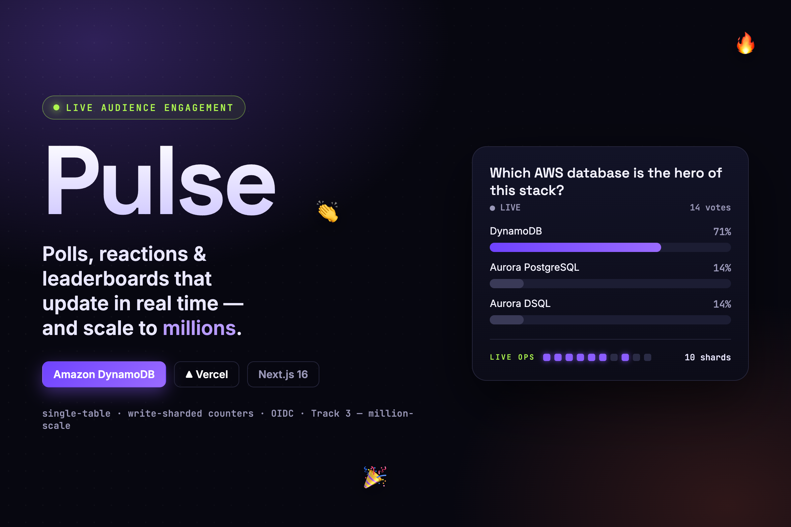
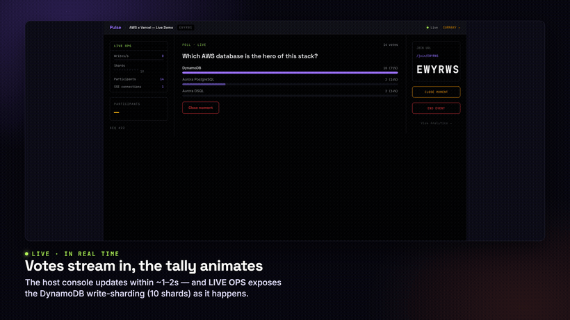
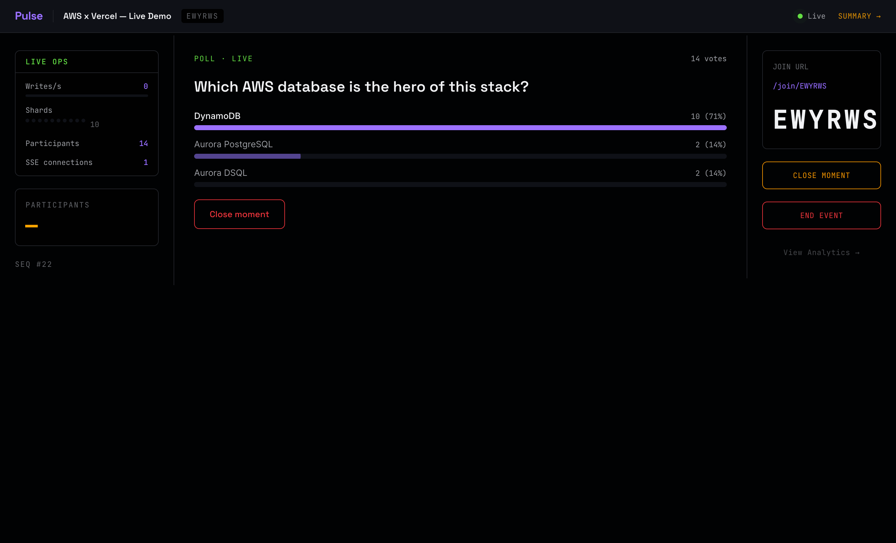
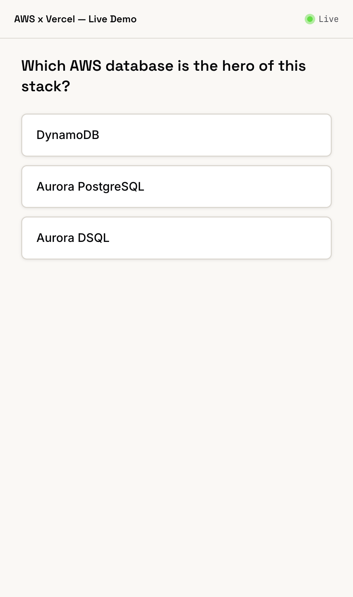
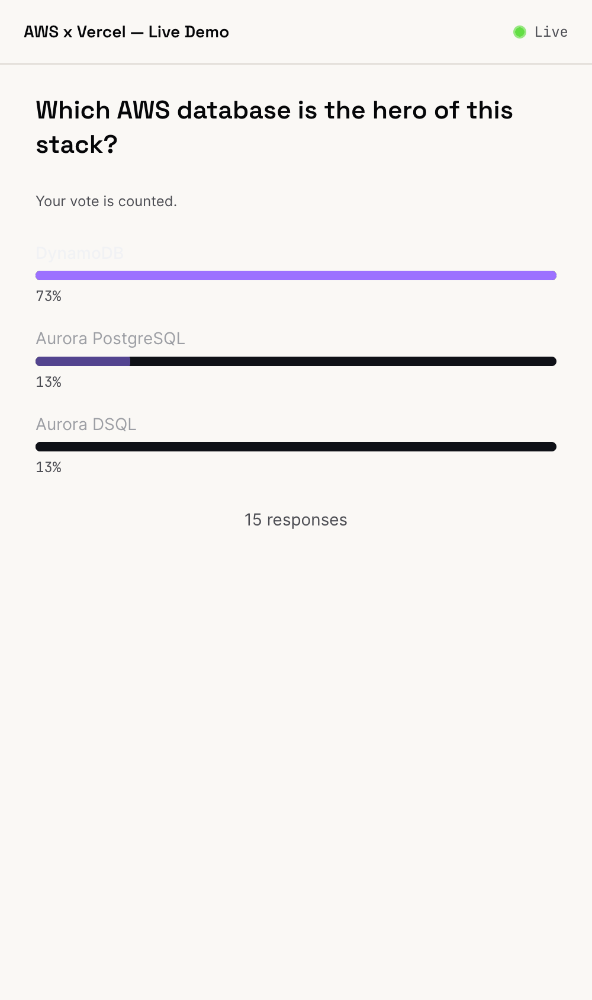
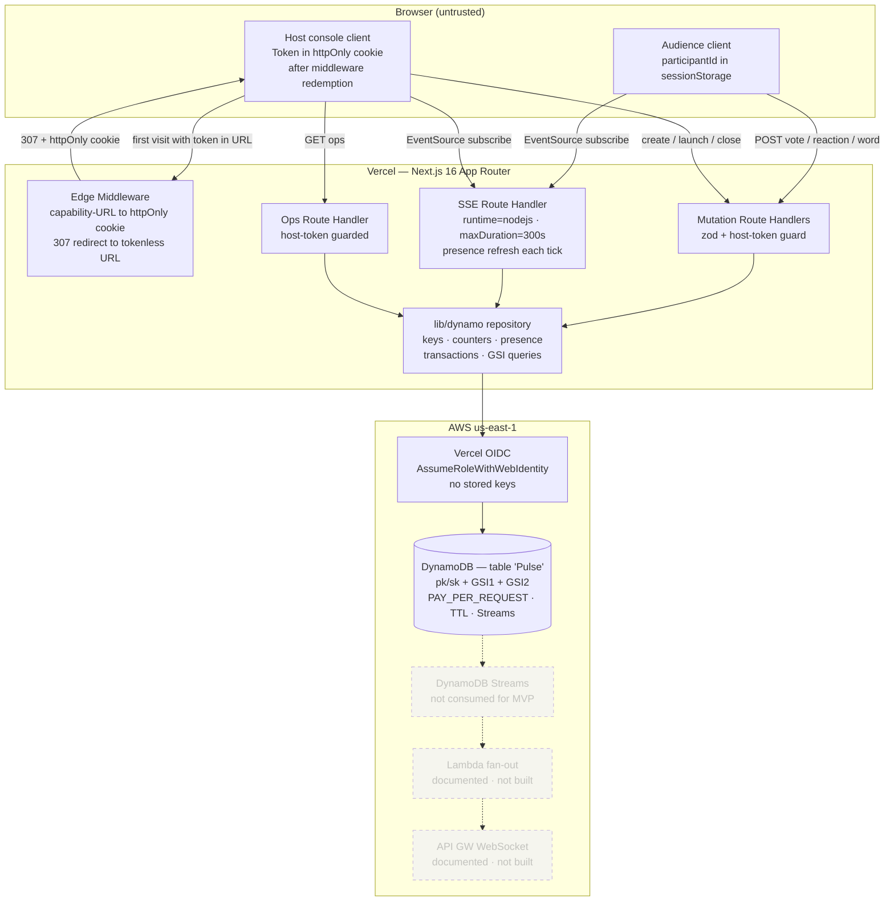

# Pulse



**Real-time audience engagement for live events — polls, word clouds, emoji reactions, trivia leaderboards.**

Built for the _H0: Hack the Zero Stack with Vercel, v0 and AWS Databases_ hackathon (Track 3 — million-scale). The database is the hero: a DynamoDB single-table design with write-sharded atomic counters sits at the center of every feature.

Score: **92 / 100** · Tests: **137 unit + 24 integration + 3 E2E** · Load test: **5 000 writes, 0 lost** · p95 latency: **~1.3 s** (gate is < 2 s)

## 🔴 Live demo

**[pulse-ochre-six.vercel.app](https://pulse-ochre-six.vercel.app)** — deployed on Vercel, backed by Amazon DynamoDB (us-east-1) via Vercel OIDC (no stored keys). Open it, create an event, and join from your phone with the code.

▶ **Walkthrough:** [`docs/demo/demo.mp4`](docs/demo/demo.mp4) (38 s)




<sub>Host control room: a live poll tallying in real time, with the **LIVE OPS** panel exposing the DynamoDB write-sharding (10 shards) and participant/SSE counts — the database, made visible.</sub>

| | |
|---|---|
| Audience (mobile) — vote | Audience (mobile) — live results |
|  |  |

---

## What Pulse Does

A host creates an event in seconds and shares a 6-character join code. Audience members join anonymously (display name only, no account) from any browser. The host launches interactive moments and every connected screen sees results update in near real time.

**Personas**

| Role | Job | Pain avoided |
|------|-----|-------------|
| Host (streamer, teacher, speaker) | Launch moments at the right time, see live aggregates, receive an analytics summary | Fragmented tool switching, stale results |
| Audience member | Join in seconds, participate with one tap, see the live aggregate | Mandatory registration, confusing UI |

---

## The Database is the Hero

Every interesting property of Pulse — vote integrity, no-double-vote guarantee, million-scale write throughput — comes directly from DynamoDB design choices:

- **Single table** (`Pulse`, `pk`/`sk`) keeps all entities in one consistency domain and enables composite queries with `begins_with`.
- **Write-sharded counters** (≥ 10 shards per option, env-tunable via `SHARD_COUNT`) spread a 5 000 write/s burst across ~500 writes/s per shard, safely below DynamoDB's per-partition ceiling.
- **`TransactWriteItems`** fuses the vote dedup `Put` and the counter `ADD` into one atomic operation — a vote and its tally can never diverge.
- **GSI2** (`gsi2pk` = `LBEVENT#<eventId>`, `gsi2sk` = zero-padded score) gives top-N leaderboard in O(N) with `ScanIndexForward=false, Limit=N` — no Scan anywhere.
- **DynamoDB Streams** are already enabled; the Lambda → API Gateway WebSocket fan-out is the documented path to millions of concurrent viewers (not built for MVP).

The **OpsReadout** component on the host console makes this visible to judges: live writes/s, participant count, SSE-subscriber count, and shard-activity dots — all sourced live from the database.

---

## Feature List

- Create an event instantly; receive a host console URL and shareable join URL
- Audience join with display name only — no account required
- **MC Poll** — 2–6 options, server-enforced one-vote-per-participant, live tally bars
- **Word Cloud** — open text prompt, frequency-weighted live cloud
- **Emoji Reaction Burst** — unlimited reactions during open window, 6-emoji palette, burst visualization
- **Trivia / Leaderboard** — server-authoritative timing, cumulative scoring via `ADD`, GSI2 top-N leaderboard
- **Live snapshot stream** — SSE primary, HTTP polling fallback, < 2 s p95 latency
- **Analytics Summary** — unique participants, total interactions, peak concurrent, top-5 words per word cloud
- **OpsReadout** — live writes/s, shard-activity dots (judge-facing prestige feature)
- Host auth via capability-URL redeemed into an httpOnly SameSite=Strict cookie by Edge middleware
- Zero stored AWS credentials — Vercel OIDC (`AssumeRoleWithWebIdentity`)

---

## Tech Stack

| Layer | Technology |
|-------|-----------|
| Framework | Next.js 16 (App Router, TypeScript strict) |
| Database | Amazon DynamoDB — single table, PAY_PER_REQUEST, two GSIs, Streams enabled |
| Real-time | SSE Route Handlers (`runtime=nodejs`, `maxDuration=300`) + HTTP polling fallback |
| Credentials | Vercel OIDC (`@vercel/oidc-aws-credentials-provider`) — no stored keys |
| Infrastructure | AWS CDK v2 (TypeScript) |
| Tests | Vitest (unit + integration vs DDB Local) + Playwright (E2E) |
| Local DB | `amazon/dynamodb-local` via Docker Compose |
| Validation | zod at every API boundary |

---

## Quickstart (Local Development)

**Prerequisites:** Node.js 20 LTS, npm 10+, Docker

```bash
# 1. Install dependencies
npm install

# 2. Start DynamoDB Local
npm run ddb:up

# 3. Create the table schema + indexes locally
npm run ddb:init

# 4. Seed a demo event
npm run seed

# 5. Start the dev server
npm run dev
```

The app runs at `http://localhost:3000`.

Copy `.env.example` to `.env.local` and set `PULSE_DB_MODE=local`. No real AWS credentials are needed for local development.

**Shortcut — all steps in one command:**

```bash
npm run dev:local   # ddb:up + ddb:init + next dev
```

### Key URLs

| Surface | URL pattern |
|---------|-------------|
| Landing (create or join) | `http://localhost:3000/` |
| Audience join by code | `/join` or `/join/<code>` |
| Live audience view | `/e/<code>` |
| Host console | `/host/<eventId>/<hostToken>` (redirects to tokenless URL after first visit) |
| Host analytics summary | `/host/<eventId>/summary` (after middleware redemption) |

The `hostToken` is returned by `POST /api/events`. Edge middleware redeems it into an httpOnly cookie on first visit and 307-redirects to the tokenless path — the token does not persist in browser history.

---

## Test Commands

```bash
# Unit tests (Vitest)
npm test

# Watch mode
npm run test:watch

# Coverage report (target: ≥ 80% on business-logic modules)
npm run test:coverage

# Integration tests only (requires DynamoDB Local running)
npm run test:integration

# E2E — Playwright (requires dev server and DDB Local running)
npm run e2e

# Latency probe — measures vote-to-second-client p95 (gate: < 2 000 ms)
# Requires dev server + DDB Local
npm run latency-probe

# Load test — 5 000 concurrent writes, asserts 0 lost votes, 0 throttling errors
npm run loadtest
```

---

## Architecture Summary



---

## Project Layout

```
pulse/
├── src/
│   ├── app/
│   │   ├── page.tsx                          # Landing — create or join
│   │   ├── join/[code]/page.tsx              # Audience join (code pre-filled)
│   │   ├── e/[code]/page.tsx                 # Live audience view
│   │   ├── host/[eventId]/page.tsx           # Host console (tokenless post-redemption)
│   │   ├── host/[eventId]/summary/page.tsx   # Analytics summary
│   │   └── api/
│   │       ├── events/route.ts               # POST create event
│   │       ├── events/[eventId]/route.ts     # GET state / POST close
│   │       ├── events/[eventId]/ops/route.ts # GET ops readout (host-gated)
│   │       ├── join/route.ts                 # POST join by code
│   │       ├── events/[eventId]/moments/     # POST launch / POST close moment
│   │       ├── votes/route.ts                # POST MC or trivia vote
│   │       ├── reactions/route.ts            # POST emoji reaction
│   │       ├── words/route.ts                # POST word submission
│   │       ├── leaderboard/route.ts          # GET top-N (GSI2)
│   │       ├── stream/[eventId]/route.ts     # GET SSE stream + ?once=1 fallback
│   │       └── summary/[eventId]/route.ts    # GET analytics payload (host-gated)
│   ├── components/                           # Audience + host UI surfaces
│   ├── hooks/                                # useLiveSnapshot · useOpsReadout · useParticipant
│   ├── lib/
│   │   ├── dynamo/                           # client · keys · counters · repository
│   │   ├── auth/                             # hostToken · hostCookie
│   │   ├── validation/                       # zod schemas
│   │   ├── moment/                           # scoring · wordcloud
│   │   ├── config.ts                         # SHARD_COUNT · intervals · TTLs
│   │   └── observability/log.ts
│   └── middleware.ts                         # Edge: host capability-URL redemption
├── infra/cdk/                                # DynamoDB CDK stack (gated deploy)
├── scripts/
│   ├── init-local-table.ts                   # ddb:init
│   ├── seed.ts                               # seed demo event
│   ├── loadtest.ts                           # 5 000 write load test
│   └── latency-probe.ts                      # p95 latency measurement
├── test/unit/  test/integration/  test/e2e/
├── .env.example
├── docker-compose.yml                        # amazon/dynamodb-local
└── next.config.ts                            # CSP + security headers
```

---

## Why DynamoDB / Track 3 Scale

Pulse is Track 3 (million-scale). Every design decision maps to a DynamoDB capability:

| Requirement | DynamoDB capability |
|-------------|---------------------|
| No double votes, exact tally | `TransactWriteItems` — conditional dedup + counter `ADD` atomically |
| 5 000 writes/s to one event without throttling | Write-sharded counters (≥ 10 shards/option) |
| Top-N leaderboard without Scan | GSI2 `Query ScanIndexForward=false Limit=N` |
| Analytics survive the judging window | Per-item-type TTL — durable items carry no `ttl` attribute |
| Millions of concurrent viewers (scale-out path) | DynamoDB Streams already enabled |
| Zero operational overhead | `PAY_PER_REQUEST` — no capacity planning |

---

## Related Docs

| Document | Purpose |
|----------|---------|
| [ARCHITECTURE.md](./ARCHITECTURE.md) | Component diagram, single-table design, write/read sequence diagrams, scale-out path |
| [docs/RUNBOOK.md](./docs/RUNBOOK.md) | Operate, monitor, troubleshoot common failures |
| [DEPLOYMENT.md](./DEPLOYMENT.md) | Production deploy — OIDC bootstrap, CDK, Vercel env vars |
| [SECURITY.md](./SECURITY.md) | Threat model, findings table, remediation status |
| [PLAN.md](./PLAN.md) | Engineering design — all access patterns, data flows, milestones |
| [DESIGN.md](./DESIGN.md) | UI/UX specification, design tokens, component specs |
| [docs/adr/](./docs/adr/) | Architecture Decision Records |
| [docs/SUBMISSION.md](./docs/SUBMISSION.md) | Hackathon submission kit (Devpost text + checklist) |
| [docs/DEMO_SCRIPT.md](./docs/DEMO_SCRIPT.md) | Demo video beat-by-beat script (< 3 minutes) |
